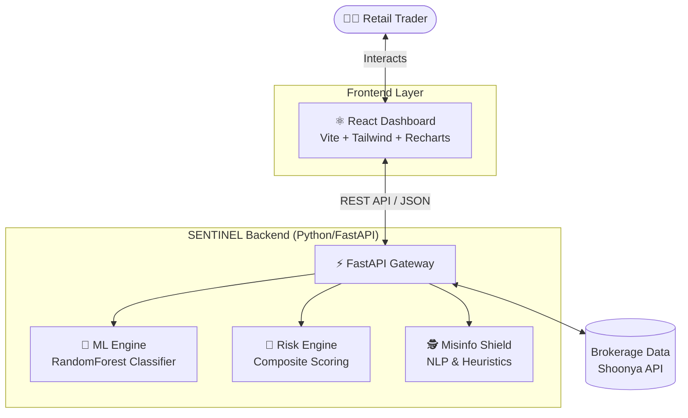

# 🛡️ SENTINEL
**AI-Powered Behavioral Finance Protection Layer for Retail Traders**

[](https://www.python.org/downloads/release/python-3110/)
[](https://fastapi.tiangolo.com)
[](https://reactjs.org/)
[](https://vitejs.dev/)
[](https://opensource.org/licenses/MIT)

> Built for **Finvasia Innovation Hackathon 2026** at Chitkara University

## 🚨 The Problem
Indian retail options traders (F&O) face massive losses, with 90% of individual traders losing money according to SEBI. The root cause usually isn't a lack of technical knowledge, but **emotional and behavioral failures** during live trading. 

When traders experience a loss, they are prone to revenge trading, FOMO, panic selling, and overtrading. Traditional trading platforms execute these harmful orders without friction, leading to massive capital destruction. 

## 🛡️ The Solution: SENTINEL
**"Don't block trades. Give traders a mirror."**

SENTINEL wraps around existing brokerage platforms (like Shoonya) as an intelligent, real-time protection layer. Instead of outright blocking users, SENTINEL analyzes every action, detects dangerous behavioral patterns, and intervenes with psychological circuit breakers before the mistake is made.

### 🌟 Key Features
- **🧠 Behavioral ML Model**: A Random Forest Classifier trained to detect 7 distinct emotional trading patterns (revenge trading, FOMO, overtrading, late-night trading, panic selling, herd trading).
- **⏱️ Psychological Circuit Breaker**: The "CoolDown Card" intercepts dangerous trades with a 60-second breathing exercise and confronts the user with their own historical loss rates for that specific pattern.
- **⚡ Live Risk Scoring**: Real-time composite risk score (0-100) combining loss recency, trade frequency, position sizing, time of day, and social media influence.
- **📉 Portfolio Stress Tester**: Simulates how existing portfolios would behave under historical crashes (2008 Crisis, 2020 COVID Crash, flash crashes) and recommends hedges.
- **🕵️ Misinformation Shield**: NLP-powered tip checker that analyzes forwarded tips for pump-and-dump signals, urgency manipulation, and SEBI compliance red flags.
- **💬 AI Finance Coach**: Interactive chatbot powered by Anthropic's Claude that explains trading concepts simply (with Indian market context) but never provides specific buy/sell advice.

---

## 🏗️ Architecture



---

## 🛠️ Tech Stack
| Tier | Technologies |
|------|--------------|
| **Backend** | Python 3.11, FastAPI, Uvicorn |
| **Data/ML** | Scikit-Learn, Pandas, NumPy, Joblib |
| **Frontend** | React 18, Vite, TailwindCSS (v3), Recharts, Lucide Icons |
| **AI Services** | OpenAI API (gpt-4o-mini) |

---

## 🚀 Setup Instructions

### Prerequisites
- Node.js 20+
- Python 3.11+
- OpenAI API Key (for the chatbot)

### 1. Backend Setup
```bash
cd backend
python -m venv venv
# On Windows:
.\venv\Scripts\activate
# On Mac/Linux:
source venv/bin/activate

pip install -r requirements.txt

# Start the FastAPI server (will auto-train ML model & generate mock data on first run)
python -m uvicorn main:app --host 0.0.0.0 --port 8000 --reload
```

### 2. Frontend Setup
```bash
cd frontend
npm install

# Create environment variables (Optional but needed for AI Coach)
echo "VITE_OPENAI_API_KEY=your_key_here" > .env

# Start the Vite development server
npm run dev
```
The application will be available at `http://localhost:5173/` or `http://localhost:5174/`.

---

## 🔌 API Documentation / Examples

Start the backend and then test with `curl` or `httpie`:

**1. Analyze a Trade**
```bash
curl -X POST http://localhost:8000/api/analyze-trade \
  -H "Content-Type: application/json" \
  -d '{"symbol": "BANKNIFTY", "quantity": 50, "trade_type": "BUY", "current_portfolio_value": 500000, "recent_trades_count": 4, "last_loss_amount": 3200, "last_loss_minutes_ago": 4, "position_size_inr": 85000, "followed_social_tip": false}'
```

**2. Check Stock Tip for Misinformation**
```bash
curl -X POST http://localhost:8000/api/check-tip \
  -H "Content-Type: application/json" \
  -d '{"tip_text": "🚀🚀 BUY XYZ PHARMA NOW!! Will give 10x returns. Guaranteed profits!!"}'
```

**3. Get Live Risk Score**
```bash
curl http://localhost:8000/api/risk-score/user_001
```

**4. Run Portfolio Stress Test**
```bash
curl -X POST http://localhost:8000/api/stress-test \
  -H "Content-Type: application/json" \
  -d '{"portfolio_value": 500000, "positions": [{"symbol": "HDFC", "value": 75000, "sector": "Banking"}], "scenario": "2008_crisis"}'
```

---

## 🎬 Live Demo Instructions
During the Hackathon judging, click the **"Live Demo Mode"** button in the sidebar. This triggers a 3-step sequenced story:
1. **Safe State:** Dashboard loads with a low risk score.
2. **First Loss:** A normal trade registers a loss. Risk score increments.
3. **Revenge Trade:** 3 seconds later, a massive trade is placed. The AI intercepts it, triggers the breathing exercise overlay, and shows the user their historical win rate for Revenge Trades (~12%).
4. **Resolution:** The user cancels the trade, confetti drops, and the dashboard tracks "₹6,400 saved from emotional intervention."

---

## 👥 Meet the Team
**Finvasia Hackathon 2026**
- *Piyush Prajapati* - Backend Developer
- *Prachi Bhardwaj* - Frontend Developer

## 📄 License
[MIT License](LICENSE)
